<div align="center">

<picture>
  
</picture>

# ZK SHARK AGENT

### Shark of All Streets · `pkg/zkomni` · `@clawd/zk-shark-agent`

Go owns discovery, inspect, and intent routing. Node stays a sidecar.

```bash
clawdbot zero zkomni inspect
clawdbot zero zkomni ask "derive a nullifier for context foo"
clawdbot zero zkomni plan --action attest --memo demo
```

</div>

**zk-shark-agent** lives in [`./zk-primitives/agent`](zk-primitives/agent) and is a first-class Go surface in [`pkg/zkomni`](pkg/zkomni). `inspect` and `ask` need no Node, no RPC, and no wallet. The TypeScript CLI (`zk-shark-agent` / `shark-of-all-streets`) is the optional sidecar for Groth16 proofs and Light Protocol execution.

| Command | What it does | Node? |
|---------|--------------|-------|
| `clawdbot zero zkomni inspect` | Paths, package, completeness (plays the shark on a TTY) | no |
| `clawdbot zero zkomni ask "…"` | Deterministic intent router (twin of `src/intents.ts`) | no |
| `clawdbot zero zkomni plan` | RH ↔ Solana msgType-4 Ed25519 proof of knowledge | no |
| `clawdbot zero zkomni oneshot` | Plan + best-effort robinhood-agents relayer | optional |

Env owner is `CLAWDBOT_ZK_PRIMITIVES_DIR` (cwd walk to `./zk-primitives` otherwise). `CLAWD_CLOUD_ROOT` is not consulted.

---

<div align="center">

<picture>
  
</picture>

# CLAWD BOT

### 🦞 Open-source agent runtime for Solana (and Robinhood Chain)

[](https://go.dev)
[](https://www.npmjs.com/package/clawdbot-go)
[](https://github.com/Solizardking/Zero-Bruh/releases/latest)
[](https://solana.com)
[](https://robinhoodchain.blockscout.com)
[](LICENSE)

[Product](https://cheshireterminal.ai/zeroclawd) · [GitHub](https://github.com/Solizardking/Zero-Bruh) · [npm `clawdbot-go`](https://www.npmjs.com/package/clawdbot-go) · [Release v1.0.3](https://github.com/Solizardking/Zero-Bruh/releases/tag/v1.0.3) · [Agent hub](https://cheshireterminal.ai/agents) · [Security](SECURITY.md)

</div>

**Clawd Bot** is a small, self-hostable runtime for AI agents on **Solana** — trading loops, wallets, market data, skills, and a local web console — without a heavy cloud stack.

It is **Solana-first**. Robinhood Chain / EVM is additive via an open skill pack. You bring your own keys; live money paths stay opt-in.

---

## Start here (3 minutes)

```bash
npm i -g clawd-go
clawdbot install
```

That’s it. Same installer: [`@clawd-bot/clawd`](https://www.npmjs.com/package/@clawd-bot/clawd) · [`clawdbot-go`](https://www.npmjs.com/package/clawdbot-go) · [`@x402solana/clawd-bot`](https://www.npmjs.com/package/@x402solana/clawd-bot). Unscoped `clawd` / `clawdbot` / `clawd-bot` names are taken or blocked on npm; after install you still get the **`clawd`** and **`clawdbot`** bins. Then connect the hosted UI to your local console.

Pick **one** Clawd path:

| Path | Command | What you get |
|------|---------|--------------|
| **A · npm (recommended)** | `npm i -g clawd-go && clawdbot install` | Clawd skills + env into `~/.clawdbot` |
| **B · curl skills** | `curl -fsSL https://raw.githubusercontent.com/Solizardking/Zero-Bruh/main/install-npm.sh \| bash` | Same as A (+ optional Clawd Go CLI) |
| **C · curl Go CLI** | `curl -fsSL https://raw.githubusercontent.com/Solizardking/Zero-Bruh/main/install.sh \| bash` | Prebuilt Clawd `clawdbot` (no Go) when a matching `clawdbot-$GOOS-$GOARCH` asset exists; otherwise builds from source |
| **D · this checkout** | `export CLAWDBOT_CORS_ORIGINS=https://cheshireterminal.ai && ./start.sh` | Build + Clawd animated launcher + web |

Install prints a **Clawd** live tape of Pump.fun token launches from [https://solgpt.us/pump](https://solgpt.us/pump). Skip with `CLAWDBOT_SKIP_PUMP_TAPE=1`.

```bash
# After any Clawd install — local console + Cheshire Connect
export CLAWDBOT_CORS_ORIGINS=https://cheshireterminal.ai
clawdbot web    # → http://127.0.0.1:18800
# Open https://cheshireterminal.ai/zeroclawd → Connect → http://127.0.0.1:18800
```

| Piece | What it is |
|-------|------------|
| **CLI** (`clawdbot`) | Agent chat, OODA, catalog, doctor, status, web console |
| **zk-shark-agent** | [`pkg/zkomni`](pkg/zkomni) — inspect / ask / plan; sidecar `./zk-primitives/agent` |
| **npm** ([`clawd-go@1.0.6`](https://www.npmjs.com/package/clawd-go)) | One-shot skill pack + `clawd` / `clawdbot` CLI |
| **Skills** | 24 RH/EVM pack skills plus train2earn/skills/skills and [skillhub-main/skills](https://github.com/Solizardking/skillhub-main/tree/main/skills) embedded in the binary |
| **Web console** | `clawdbot web` — in-process dashboard at `127.0.0.1:18800` (no `go run`, no checkout) |
| **Solana Mobile** | [`mobile/`](mobile/) — Expo + MWA + expo-secure-store auth cache |
| **Scripts** | [`install-npm.sh`](install-npm.sh) · [`install.sh`](install.sh) · [`start.sh`](start.sh) |

### Names (quick)

| You see… | Means… |
|----------|--------|
| **Clawd** / **Clawd Bot** | Product name (banners, DNA, UI, install chrome) |
| **`clawd-go`** | npm package — `npm i -g clawd-go` |
| **`clawd` / `clawdbot`** | npm CLI bins after install (`clawdbot install`) |
| **`zero-clawd`** | extra npm bin alias for `clawdbot-go` |
| **Zero-Bruh** | Public GitHub repo |
| **`cheshire-terminal-agents`** | Separate agents SDK (not this Go runtime) |
| **zk-shark-agent** | ZK sidecar (`@clawd/zk-shark-agent`) owned by `pkg/zkomni` |

### Docs map (read these next)

| Doc | For |
|-----|-----|
| [**SPA ↔ agent**](docs/CHESHIRE_CLIENT.md) | Cheshire Terminal client routes, probe/chat, create-agent |
| [**`pkg/` map**](docs/PKG_MAP.md) | All 56 Go packages — what each does |
| [**SOL GPT tools**](docs/SOL_GPT_TOOLS.md) | **72** non-custodial trading research tools (Phoenix, Birdeye, Helius, DFlow) |
| [**RH skill stack**](docs/RH_CRYPTO_AGENT_STACK.md) | FunPump / Uniswap open pack |
| [**Security**](SECURITY.md) | Threat model + secrets |

**Jump:** [ZK Shark](#zk-shark-agent) · [Install detail](#-one-shot-install-grok-build-style) · [Connect](#e--connect-from-cheshire-terminal-hosted-zeroclawd) · [Computer / E2B](#f--cheshire-terminal-computer-e2b--clawd-holders) · [Quick Start](#-quick-start) · [Architecture](#-architecture) · [CLI](#-cli-reference) · [Six laws](#-the-six-law-harness)

### Official release

| Channel | Status |
|---------|--------|
| **GitHub** | [Solizardking/Zero-Bruh](https://github.com/Solizardking/Zero-Bruh) · [**v1.0.3**](https://github.com/Solizardking/Zero-Bruh/releases/tag/v1.0.3) |
| **npm** | [`clawd-go@1.0.6`](https://www.npmjs.com/package/clawd-go) · [`clawdbot-go@1.0.6`](https://www.npmjs.com/package/clawdbot-go) · [`@x402solana/clawd-bot`](https://www.npmjs.com/package/@x402solana/clawd-bot) · homepage [zeroclawd](https://cheshireterminal.ai/zeroclawd) |
| **Install scripts** | [`install-npm.sh`](https://raw.githubusercontent.com/Solizardking/Zero-Bruh/main/install-npm.sh) · [`install.sh`](https://raw.githubusercontent.com/Solizardking/Zero-Bruh/main/install.sh) |
| **Hosted connect** | [cheshireterminal.ai/zeroclawd](https://cheshireterminal.ai/zeroclawd) |
| **Computer / E2B** | In-repo template [`e2b/clawdbot-computer`](e2b/clawdbot-computer) (`python e2b/clawdbot-computer/build.py`) · hosted [cheshire-computer](https://cheshireterminal.ai/cheshire-computer) |

---

## 🚀 One-shot install (Grok Build style)

Every path below installs **Clawd**. Banners, tape, and post-install chrome
always say Clawd.

**Published package:** [`clawd-go@1.0.6`](https://www.npmjs.com/package/clawd-go) on npm  
(`npm i -g clawd-go`, then run **`clawdbot install`**). Same bits: [`clawdbot-go`](https://www.npmjs.com/package/clawdbot-go) · [`@x402solana/clawd-bot`](https://www.npmjs.com/package/@x402solana/clawd-bot).

**Skills are prepackaged at install** — every `skills/*/SKILL.md` in this repo
(`pack-index.json` v2, **23** skills) is copied to `~/.clawdbot/skills` and
symlinked into `~/.agents`, `~/.claude`, and `~/.codex` skill roots.

The Clawd installer also prints a live Pump.fun launch tape from
[https://solgpt.us/pump](https://solgpt.us/pump) (same public relay as the web
page). It is time-bounded and never fails the install. Skip with
`CLAWDBOT_SKIP_PUMP_TAPE=1`.

### A · npm (recommended) — Clawd

```bash
npm i -g clawd-go
clawdbot install

# Same bits, other names:
npm i -g @clawd-bot/clawd
npm i -g clawdbot-go
npm i -g @x402solana/clawd-bot

# Local project dependency (postinstall prepackages the skill pack)
npm i clawd-go

# If your npm blocks install scripts:
npm i -g --allow-scripts=clawd-bot clawd-bot
```

Package page: **https://www.npmjs.com/package/clawdbot-go**  
GitHub release: **https://github.com/Solizardking/Zero-Bruh/releases/tag/v1.0.3**

```bash
# Explicit Clawd skills-only re-prepackage
npx clawdbot-go skills-install --force
# → ~/.clawdbot/skills  (+ agent root symlinks)

# From this checkout instead of npm:
git clone https://github.com/Solizardking/Zero-Bruh.git
cd Zero-Bruh && npm install
```

Skip skill prepackage: `CLAWDBOT_SKIP_SKILLS=1 npm i clawdbot-go`

### B · Full Clawd stack via curl/npm (skills + env + optional Go/birth/automaton)

Public **main** branch (raw GitHub) — both scripts return **HTTP 200**:

```bash
curl -fsSL https://raw.githubusercontent.com/Solizardking/Zero-Bruh/main/install-npm.sh | bash

# same as:
npx clawdbot-go install
# or after a global install:
clawd-bot install
# full Clawd stack inside postinstall:
CLAWDBOT_ONESHOT=1 npm i -g clawd-go@1.0.6
```

### C · Classic Clawd Go binary + source

Also seeds the RH skill pack into `~/.clawdbot/skills` and agent skill roots:

```bash
curl -fsSL https://raw.githubusercontent.com/Solizardking/Zero-Bruh/main/install.sh | bash
# or from this checkout (uses ./build/clawdbot-$GOOS-$GOARCH when present):
./install.sh
# named assets: make release-binaries
# local prebuilt, no Go: CLAWDBOT_PREBUILT=./build/clawdbot-darwin-arm64 ./install.sh
```

### D · Related one-shots (Skill Hub + agents SDK)

```bash
# Skill Hub pack (same Cheshire/RH suite as catalog skills)
npx github:Solizardking/skills install cheshire-terminal-agents --force

# Agents SDK + forge + registries (npm) — catalog/identity, NOT this Go runtime
npm i cheshire-terminal-agents
```

**[`cheshire-terminal-agents`](https://www.npmjs.com/package/cheshire-terminal-agents)**
(v1.48+) ships an **optional bridge** to this package — it does **not** hard-depend
on `clawdbot-go` and does **not** run Clawd Bot on its postinstall:

```bash
# From the agents package: discover + install Clawd (invokes npx clawdbot-go …)
npx cheshire-terminal-agents clawdbot-info
npx cheshire-terminal-agents clawdbot-install --dry-run
npx cheshire-terminal-agents clawdbot-install              # → npx clawdbot-go install
npx cheshire-terminal-agents clawdbot-install --skills-only
npx cheshire-terminal-agents clawdbot-install --global     # → npm i -g clawdbot-go && clawd-bot

# External catalog entry (discoverable, not vendored under agents packages/)
npx cheshire-terminal-agents packages-list
# → packages: clawd-agent-tui, headless-agent, …
# → external: ["clawdbot-go"]  (npmUrl → https://www.npmjs.com/package/clawdbot-go)
```

| Package | npm | Role |
|---------|-----|------|
| **This runtime** | [clawd-go@1.0.6](https://www.npmjs.com/package/clawd-go) · [clawdbot-go@1.0.6](https://www.npmjs.com/package/clawdbot-go) | Skills oneshot, CLI bins, web console `:18800` |
| **Agents / forge** | [cheshire-terminal-agents](https://www.npmjs.com/package/cheshire-terminal-agents) | Catalog, dual-chain forge, nested TS packages + optional `clawdbot-install` bridge |

Install both when you need identity forge **and** a local Clawd console.

### E · Connect from Cheshire Terminal (hosted `/zeroclawd`)

> **Canonical SPA ↔ agent map:** [`docs/CHESHIRE_CLIENT.md`](docs/CHESHIRE_CLIENT.md)  
> (`# Cheshire Terminal client ↔ clawdbot-go`)

**Clawd** (this repo / [`clawdbot-go`](https://www.npmjs.com/package/clawdbot-go)) is the **local runtime**.  
**Cheshire Terminal** hosts the public SPA under `cheshire-terminal/client` that is the **hosted Clawd install + connect UI**.

| Item | Value |
|------|--------|
| npm | https://www.npmjs.com/package/clawdbot-go |
| Default console | `http://127.0.0.1:18800` |
| CORS for production SPA | `export CLAWDBOT_CORS_ORIGINS=https://cheshireterminal.ai` |

#### How this runtime talks to the Cheshire client

```
Browser (cheshireterminal.ai SPA)
  client/src/pages/ClawdbotGoPage.tsx     ← /zeroclawd UI
  client/src/lib/zeroClawd.ts            ← URL join, probe mode, allowlist, chat builders
  client/src/App.tsx                     ← routes /zeroclawd · /clawdbot-go · /clawdbot · /zero-clawd
        │
        ├─ loopback agent (default http://127.0.0.1:18800)
        │     browser-direct fetch → GET /api/health · /api/status · /api/dna
        │     (requires CORS: CLAWDBOT_CORS_ORIGINS=https://cheshireterminal.ai)
        │
        └─ same-origin Cheshire API (Fly)
              GET  /api/zeroclawd/npm           → registry.npmjs.org/clawdbot-go/latest
              POST /api/zeroclawd/probe         → SSRF-hardened proxy for public agent hosts
              POST /api/zeroclawd/chat          → hosted chat bridge → your agent
              POST /api/zeroclawd/create-agent  → custom SOUL.md + DNA + optional Gemini avatar

Local clawdbot-go web console (compiled into the clawdbot binary)
  clawdbot web --no-browser -p 18800   ·or·  ./start.sh
  (source-tree fallback: go run ./web/backend -port 18800 -no-browser)
  Serves: /api/health · /api/status · /api/dna · chat · ecosystem · RH readiness
```

#### SPA tree that talks to this agent

```
cheshire-terminal/client/
  src/App.tsx                         routes /zeroclawd · /clawdbot-go · /clawdbot · /zero-clawd
  src/pages/ClawdbotGoPage.tsx        install one-shots, Connect, health/status/DNA, chat
  src/lib/zeroClawd.ts                normalize base URL, probe mode, allowlist, chat builders
  src/lib/zeroClawd.test.ts           fixtures matching web/backend responses
  src/pages/CheshireComputerPage.tsx  E2B desk → installs clawdbot-go for CLAWD holders
  src/components/                     shared nav, badges, layout
  src/hooks/ · src/contexts/          wallet / auth shell around the hub
  src/main.tsx · index.css            SPA bootstrap
```

| Cheshire client path | Role |
|----------------------|------|
| `client/src/pages/ClawdbotGoPage.tsx` | Install copy, Connect form, health/status/DNA, chat |
| `client/src/lib/zeroClawd.ts` | Contracts mirror this backend; probe mode + allowlist |
| `client/src/lib/zeroClawd.test.ts` | Fixtures for go-bot health/status/DNA |
| `client/src/App.tsx` | Public routes (no $CLAWD gate) |
| `client/src/pages/CheshireComputerPage.tsx` | E2B desk installs `clawdbot-go` for holders |
| `client/src/components/*` · `hooks/*` · `contexts/*` | Shared shell (nav, wallet, UI) around the hub |
| `server/routes/zeroclawd.ts` | npm meta + probe + chat + create-agent (not in `client/`, but same product) |

| From SPA | To | When |
|----------|-----|------|
| `fetch(http://127.0.0.1:18800/api/health)` etc. | This process (`web/backend`) | Loopback / LAN agent (browser-direct) |
| `POST /api/zeroclawd/probe` | Cheshire Fly API → your public agent | Non-loopback agent base URL |
| `POST /api/zeroclawd/chat` | Cheshire Fly API → agent chat | Hosted chat bridge |
| `GET /api/zeroclawd/npm` | `registry.npmjs.org/clawdbot-go/latest` | Live package card on `/zeroclawd` |
| `POST /api/zeroclawd/create-agent` | Cheshire Fly API | Custom SOUL.md + DNA + optional Gemini avatar |

Allowlisted agent paths (browser / probe): see `ZERO_CLAWD_AGENT_ALLOWLIST` in `client/src/lib/zeroClawd.ts` (full map: [`docs/CHESHIRE_CLIENT.md`](docs/CHESHIRE_CLIENT.md)).

| Surface | Where |
|---------|--------|
| **Product hub** | [cheshireterminal.ai/zeroclawd](https://cheshireterminal.ai/zeroclawd) |
| **Aliases** | `/clawdbot-go` · `/clawdbot` · `/zero-clawd` |
| **Agent hub / forge** | [/agents](https://cheshireterminal.ai/agents) · [/agents/forge](https://cheshireterminal.ai/agents/forge) |
| **Computer desk** | [/cheshire-computer](https://cheshireterminal.ai/cheshire-computer) |
| **Install scripts** | [`install-npm.sh`](install-npm.sh) · [`install.sh`](install.sh) (printed steps end with the CT connect loop) |
| **Local console** | `clawdbot web` → `http://127.0.0.1:18800` (`web/backend` + `web/frontend`) |
| **npm package** | [`clawd-go@1.0.6`](https://www.npmjs.com/package/clawd-go) · [`clawdbot-go@1.0.6`](https://www.npmjs.com/package/clawdbot-go) |
| **GitHub release** | [v1.0.3](https://github.com/Solizardking/Zero-Bruh/releases/tag/v1.0.3) |

#### Minimal Clawd connect loop

```bash
# Clawd one-shots (same curl lines as the hosted hub + release notes)
curl -fsSL https://raw.githubusercontent.com/Solizardking/Zero-Bruh/main/install-npm.sh | bash
curl -fsSL https://raw.githubusercontent.com/Solizardking/Zero-Bruh/main/install.sh | bash
# from this checkout:
./install-npm.sh
./install.sh

# Or via npm (package name is clawdbot-go; the CLI you run is clawd-bot)
npm install -g clawdbot-go
clawd-bot install
export CLAWDBOT_CORS_ORIGINS=https://cheshireterminal.ai
clawdbot web --no-browser   # in-process Clawd console; no go run required
# open https://cheshireterminal.ai/zeroclawd → Connect → http://127.0.0.1:18800
```

From this source checkout (animated launcher):

```bash
export CLAWDBOT_CORS_ORIGINS=https://cheshireterminal.ai
./start.sh
```

#### Create agent on the site

On [cheshireterminal.ai/zeroclawd](https://cheshireterminal.ai/zeroclawd) operators can author a custom agent:

1. Name, role, system prompt (becomes `SOUL.md` for `pkg/agent` `LoadSoul`)
2. Optional personality + tagline (`IDENTITY.md`)
3. Synthetic `agent-dna.json` (`clawd.agent.dna/v1`, same shape as `pkg/dna`)
4. Optional Gemini Nano Banana avatar

Drop the downloaded files into `~/.clawdbot/workspace/<slug>/` (or this repo root), start the web console with CORS, then Connect.

**Agent endpoints the SPA probes** (browser-direct for loopback; `/api/zeroclawd/probe` for public agents):

| Endpoint on `:18800` | Role |
|----------|------|
| `GET /api/health` | Liveness · agent **Clawd** · package `clawdbot-go` · product URL |
| `GET /api/status` | Runtime status (+ `public_links` ecosystem map) |
| `GET /api/dna` | Starter DNA |
| `GET /api/ecosystem` | Product/repo surfaces (zeroclawd, agents, SkillHub, …) |
| `GET /api/rh/readiness` | RH 4663 presence gate |
| `GET /api/mcp/blockscout` | Blockscout MCP status + redacted host config |

Also: live npm meta via Cheshire `GET /api/zeroclawd/npm` → `registry.npmjs.org/clawdbot-go/latest` (**1.0.4**).

### F · Cheshire Terminal Computer (E2B) · CLAWD holders

**In this repo:** [`e2b/clawdbot-computer`](e2b/clawdbot-computer) is a Python E2B Template SDK image (`alias: clawdbot-computer`) that bakes `npx clawdbot-go@latest` (skills-install + oneshot `--skip-go`) and serves a desk on port **8787**. Spawn it from the web console at `#/computer` (`GET|POST /api/e2b/computer`) after `python e2b/clawdbot-computer/build.py`.

**Hosted product path:** **Clawd** ([`clawdbot-go`](https://www.npmjs.com/package/clawdbot-go)) is also installed by the **Cheshire Terminal Computer** — not only by this repo’s scripts.

| Piece | Detail |
|-------|--------|
| **Desk UI** | [cheshireterminal.ai/cheshire-computer](https://cheshireterminal.ai/cheshire-computer) |
| **One-shot** | `curl -fsSL https://cheshireterminal.ai/api/e2b/install.sh \| bash` |
| **Packages only** | `curl -fsSL https://cheshireterminal.ai/api/e2b/install.sh \| bash -s -- --packages-only` |
| **E2B template** | `cheshire-terminal-computer` (preinstalls `clawdbot-go@1.0.4` + `cheshire-terminal-agents@1.48.4`) |
| **Status / install matrix** | `GET https://cheshireterminal.ai/api/e2b/computer/status` → `agentStack.clawdbotGo.npmUrl` |
| **npm package** | **https://www.npmjs.com/package/clawdbot-go** |
| **Connect after install** | [cheshireterminal.ai/zeroclawd](https://cheshireterminal.ai/zeroclawd) |

```bash
# What the Computer one-shot installs (when Node/npm is available)
npm install -g clawdbot-go@1.0.4 cheshire-terminal-agents@1.48.4
clawd-bot skills-install --force
# → bins: clawd-bot · zero-clawd · clawdbot-go · clawdbot-stack
# → skills: ~/.clawdbot/skills (23 RH pack skills)

# Inside an E2B desk shell (template or oneshot inject)
clawd-bot --help
cheshire status
ls ~/.clawdbot/skills
```

Cheshire monorepo sources (if you have the product tree checked out):

- `e2b/cheshire-terminal-computer/template.ts` — bakes packages into the sandbox image  
- `server/lib/e2b-agent-stack.ts` — install matrix + oneshot inject script  
- `server/routes/e2b-computer.ts` — `GET /api/e2b/install.sh` · `POST /api/e2b/oneshot`  
- `client/src/pages/CheshireComputerPage.tsx` — holder stack UI with npmjs links  

Loopback agents are probed **from your browser** (not the Cheshire server).  
Public remote hosts use the same-origin probe bridge (SSRF-hardened — private/link-local/loopback blocked server-side).

| What you get | Path |
|--------------|------|
| RH skill pack (23) | `~/.clawdbot/skills` + `~/.agents/skills/*` (prepackaged) |
| Pack manifest | `~/.clawdbot/skills/.clawdbot-prepackaged.json` |
| Env template | `~/.clawdbot/.env` (`CLAWDBOT_SKILLS_DIR`, RH hooks) |
| npm package | [clawd-go@1.0.6](https://www.npmjs.com/package/clawd-go) · `npm i -g clawd-go@1.0.6` |
| GitHub | [Solizardking/Zero-Bruh](https://github.com/Solizardking/Zero-Bruh) · [release v1.0.3](https://github.com/Solizardking/Zero-Bruh/releases/tag/v1.0.3) |
| Agents bridge | [cheshire-terminal-agents](https://www.npmjs.com/package/cheshire-terminal-agents) · `npx cheshire-terminal-agents clawdbot-install` (optional; not a hard dep) |
| Cheshire Computer | [cheshire-computer](https://cheshireterminal.ai/cheshire-computer) · [install.sh](https://cheshireterminal.ai/api/e2b/install.sh) |
| In-repo E2B template | [`e2b/clawdbot-computer`](e2b/clawdbot-computer) · alias `clawdbot-computer` · `python e2b/clawdbot-computer/build.py` |
| CLI binaries | `clawd` / `clawdbot` / `clawd-go` / `clawdbot-go` (npm) · `clawdbot` (Go, via install.sh) |
| Hosted connect | [cheshireterminal.ai/zeroclawd](https://cheshireterminal.ai/zeroclawd) |
| Product | [zeroclawd](https://cheshireterminal.ai/zeroclawd) · [agents](https://cheshireterminal.ai/agents) · [forge](https://cheshireterminal.ai/agents/forge) · [funpump.ai](https://funpump.ai) |

```bash
export CLAWDBOT_SKILLS_DIR="$HOME/.clawdbot/skills"
clawd-bot skills          # list pack ids
clawd-bot inspect         # validate SKILL.md files
clawd-bot skills-install  # re-prepackage all skills
clawdbot catalog skills   # if Clawd Go binary present
```

---

## 🆕 What's New — Omni RH Pack + Live Markets + Hardened Trading

This tree is a working, verifiable trading agent — not just a dashboard.
Solana runtime stays first-class; Robinhood Chain / EVM is additive via the
bundled skill pack and `pkg/rh`.

**Robinhood Crypto Agent Open Stack (v2 · 23 skills).** Vendored under
[`skills/`](skills/) for FunPump launch, Uniswap, strategy bots, payments,
Cheshire ERC-8004 registries, omni mint, zk-omni, Blockscout `web3-dev` + MCP `blockscout-analysis`.
Product host: [funpump.ai](https://funpump.ai) · Clawd Bot:
[cheshireterminal.ai/zeroclawd](https://cheshireterminal.ai/zeroclawd) · agent hub:
[cheshireterminal.ai/agents](https://cheshireterminal.ai/agents) · forge:
[cheshireterminal.ai/agents/forge](https://cheshireterminal.ai/agents/forge).
Open agents package: [npm](https://www.npmjs.com/package/cheshire-terminal-agents) ·
[GitHub](https://github.com/Solizardking/Cheshire-Terminal-Agents) ·
[SkillHub](https://github.com/Solizardking/skillhub-main).
Core operator env: **`BLOCKSCOUT_API_KEY`** + **`RH_RPC_URL`** (chain **4663**).
The same PRO key authenticates **Blockscout MCP** (`https://mcp.blockscout.com/mcp`
via header `Blockscout-MCP-Pro-Api-Key`) — see skill `blockscout-analysis` and `pkg/mcp`.
See [docs/RH_CRYPTO_AGENT_STACK.md](docs/RH_CRYPTO_AGENT_STACK.md) and
[skills/README.md](skills/README.md).

**RH readiness in the Go runtime.** `pkg/config` loads RH settings;
`pkg/rh` builds JSON-RPC + Blockscout PRO requests; `pkg/mcp` wires Blockscout MCP
from `BLOCKSCOUT_API_KEY`. `clawdbot doctor` reports `connectors.robinhood` and
`connectors.blockscout_mcp`; web console exposes `/api/connectors`,
`GET /api/rh/readiness`, and `GET /api/mcp/blockscout` (presence only — never secret values).

**Live market data.** Web console pulls Jupiter prices (`/api/market/prices`),
Birdeye perps OI and trending when keys allow, plus strategy / backtest panels.

**Trading engine.** Risk-based position sizing, portfolio limits (drawdown
circuit breaker), and a backtest harness that replays the same `Evaluate()` as
the live OODA loop.

---

## 🏛️ Historical Lineage

> This codebase is a **forked descendant of three foundational repositories**
> that defined the academic lineage of compression, encryption, cellular
> automata, multi-agent systems, and algorithmic game theory.

### PiedPiper — Compression, Encryption & Cellular Automata

The `docs/PiedPiper-master/` directory is a verbatim archive of
[vs666/MinMax](https://github.com/vs666/MinMax), a landmark project that
implemented **data compression** (Huffman, Arithmetic, BWT+RLE),
**encryption** (AES-128, DES, RSA, cellular-automaton-based PRNG),
**Conway's Game of Life**, **multi-agent collision avoidance**, and
**cryptographic hash optimization** from first principles.

Clawd inherits three direct code descendants:

| PiedPiper Source | Clawd Package | Description |
|---|---|---|
| `GameOfLife/` | `pkg/gameoflife/` | Toroidal Life engine — the universal computer |
| `Compression/` (middle-out) | `pkg/middleout/` | Content-cache, Ralph loop, content router |
| `Compression/` (Weissman score) | `pkg/weissman/` | Compression-ratio scoring |
| `PP_HASH/` | `pkg/zero/` | Zero-dependency startup benchmark (Zero-style) |
| `MultiAgent_CollisionAvoidance/` | `pkg/routing/` | Decentralized agent routing heuristics |

And via its ZK adaptation layer (`zk-primitives/docs/PIEDPIPER_ADAPTATION.md`),
every PiedPiper algorithm has a **Solana-native zero-knowledge equivalent**:

| Classical Algorithm | ZK Primitive | On-Chain Instruction |
|---|---|---|
| Huffman/Arithmetic compression | `verifyGroth16` (proof of correct decompression) | `publish_attestation` |
| AES-128 / DES / RSA encryption | `commit_encrypted_state` (ciphertext commitment) | `commit_encrypted_state` |
| CA-based PRNG (PP_HASH) | `computeNullifier` (deterministic 32-byte hash) | Client-side derivation |
| CA-based SSH protocol | Nullifier-based session authentication | `publish_attestation` |
| Conway's Game of Life (Universal Computer) | Groth16 proof of computation | `publish_attestation` |
| Min-Max decision tree | `computeNullifier` for commitment schemes | Client-side |

The adaptation guide lives at **`zk-primitives/docs/PIEDPIPER_ADAPTATION.md`** —
a full mapping from each classical algorithm to its ZK on-chain equivalent.

### Credits

- **Varul Srivastava** (`@vs666`) — primary author of the MinMax repository,
  PP_HASH, PP_SSH, CA encryption, multi-agent collision avoidance,
  and Game of Life
- **Akshett Rai Jindal** — AES-128, Huffman static
- **Ashwin Mittal** — BWT + RLE, Huffman, image compression
- **Zishan Kazi** — DES, audio compression, arithmetic coding
- **Keshav Bansal** — DES, audio compression, arithmetic coding
- Original repository: `https://github.com/vs666/MinMax`
- License: MIT — `docs/PiedPiper-master/LICENSE`

---

## Overview

**Clawd Bot** is the world's first **Solana-native sovereign AI agent** — a full-stack autonomous trading intelligence bound by Clawd's full **six-law harness**: three immutable on-chain laws and three off-chain interpretive laws. Built in pure Go for minimal resource consumption, it orchestrates on-chain data providers, zk primitives, and x402-gated surfaces through a military-grade OODA decision loop with persistent epistemological memory.

The system compiles to three standalone binaries that run on everything from NVIDIA Jetson edge devices to cloud VMs — no containers required, no runtime dependencies, instant boot.

The codebase carries the intellectual DNA of academic pioneers in compression, encryption, and cellular automata — the algorithms of Huffman, Shannon, Fano, Rivest–Shamir–Adleman, Daemen–Rijmen (AES), the National Bureau of Standards (DES), Burrows–Wheeler, Conway, von Neumann, Ulam, and the entire PiedPiper team at IIIT Hyderabad. Every classical result has been re-expressed as a Solana ZK primitive. Every trade is provable on-chain.

### Ecosystem Links

| Surface | Role |
|:---|:---|
| `https://github.com/Solizardking/Zero-Bruh` | This Go runtime repository |
| `https://github.com/solizardking/solana-clawd` | Canonical ecosystem hub |
| `https://zk.x402.wtf` | Public x402/zk gateway and install surface |
| `https://cheshireterminal.ai` | Public terminal surface |
| [`https://cheshireterminal.ai/zeroclawd`](https://cheshireterminal.ai/zeroclawd) | Clawd Bot product surface for this runtime |
| [`https://cheshireterminal.ai/agents`](https://cheshireterminal.ai/agents) | Cheshire agent hub (catalog + live feed) |
| [`https://cheshireterminal.ai/agents/forge`](https://cheshireterminal.ai/agents/forge) | Cheshire agent forge (dual-chain identity) |
| `https://funpump.ai` | FunPump product host — RH launch UI + public launchpad APIs |
| [npm `cheshire-terminal-agents`](https://www.npmjs.com/package/cheshire-terminal-agents) | npm package: agent catalog + forge SDK + RH skill pack (not the Go binary) |
| [Cheshire-Terminal-Agents](https://github.com/Solizardking/Cheshire-Terminal-Agents) | Source repo for the open agents package |
| [SkillHub (`skillhub-main`)](https://github.com/Solizardking/skillhub-main) | Solizardking skill hub — installable agent skills library |
| `https://huggingface.co/ordlibrary/Clawd-GLM-5.2` | Public Clawd model surface |

### Core Capabilities

| Capability | Description |
|:---|:---|
| **OODA Trading Loop** | Autonomous Observe → Orient → Decide → Act cycle with RSI/EMA/ATR strategy engine, auto-optimization, ClawVault memory journaling, and hardware I2C controls |
| **Birdeye v3 Analytics** | 22 API endpoints, 19 LLM-callable agent tools — token overview, OHLCV, trade feeds, security audits, trending, wallet analytics |
| **Helius DAS + RPC** | Digital Asset Standard queries (get-asset, owner-assets, search), SPL token operations (balance, supply, largest holders), raw RPC forwarding |
| **Robinhood / EVM skill pack** | 24 open skills under `skills/` — FunPump bonded + V3 launch, Uniswap swap/LP/v4, strategy bots, HTTP 402 payments, Cheshire ERC-8004 registries, omni mint, zk-omni, Blockscout `web3-dev` + `blockscout-analysis` (MCP) |
| **RH runtime (`pkg/rh`)** | Chain **4663** JSON-RPC + Blockscout PRO helpers; readiness via doctor / `GET /api/rh/readiness`; env **`RH_RPC_URL`** + **`BLOCKSCOUT_API_KEY`** |
| **Blockscout MCP (`pkg/mcp`)** | Hosted MCP at `mcp.blockscout.com` from `BLOCKSCOUT_API_KEY`; doctor `connectors.blockscout_mcp`; `GET /api/mcp/blockscout` |
| **ZK + Privacy Primitives** | Nullifiers, attestations, encrypted state commitments, and privacy-preserving proof flows under `zk-primitives/` |
| **ZK Omnichain (RH ↔ Solana)** | msgType-4 LayerZero messages with Ed25519 PoK — `pkg/zkomni`, `clawdbot zero zkomni`, skill `cheshire-zk-omni` (pairs with cheshire-terminal `robinhood-agents`) |
| **Cloudflare Edge Installer** | Branded install routes plus read-only ZK metadata at `/.well-known/clawdbot-zk.json` |
| **Aster DEX Perpetuals** | HMAC-signed futures trading — market/limit orders, position management, stop-loss/take-profit, account analytics |
| **Jupiter Aggregator** | Best-route spot swaps with slippage protection |
| **Hardware I2C** | Arduino Modulino® sensor cluster — RGB LEDs, buzzer alerts, physical buttons, rotary knob, IMU, temp/humidity, proximity |
| **Web Console** | React + Vite dashboard — omni-chain hero, connectors (incl. Blockscout + RH RPC), keys popup, doctor, market panels |
| **Multi-Provider LLM** | OpenRouter, Anthropic, OpenAI abstraction with tool-use agent loop |
| **Dual Memory** | Local ClawVault (file-based, 7 categories) + Supabase MemoryEngine (PostgreSQL) |
| **Grok-First** | Default provider is xAI Grok — code/repl/trade, research, image, voice, fast modes |

---

## 🚀 Quick Start

### One-Shot Clawd Install (recommended)

```bash
curl -fsSL https://raw.githubusercontent.com/Solizardking/Zero-Bruh/main/install.sh | bash
```

The installer prefers a matching prebuilt (`clawdbot-$GOOS-$GOARCH` from GitHub Releases, `CLAWDBOT_PREBUILT`, or `./build/` next to `install.sh`). **Go is not required** when that asset exists. If no prebuilt matches and `go` is missing, the script exits with an explicit error instead of a silent empty install.

For the complete Solizardking/core-ai sidecar install:

```bash
curl -fsSL https://raw.githubusercontent.com/Solizardking/Zero-Bruh/main/install.sh | CLAWDBOT_INSTALL_CORE_AI=1 bash
```

Branded Cloudflare install aliases:

```bash
curl -fsSL https://install.onchainai.fund | bash
curl -fsSL https://zk.x402.wtf/clawdbot | bash
curl -fsSL https://zk.x402.wtf/clawdbot/.well-known/clawdbot-zk.json
```

> **Free AI included** — no API keys required to get started.  
> The installer pre-configures [zkrouter](https://zk.x402.wtf) (free AI routing) and a  
> SolanaTracker-backed RPC endpoint. Bring your own keys to lift rate limits.

After Clawd install:

```bash
source ~/.clawdbot/.env          # load env vars
clawdbot agent                   # Clawd AI REPL — free via zkrouter
clawdbot ooda --sim              # paper trading mode
clawdbot solana trending         # top Solana tokens
```

### Manual Install

```bash
git clone https://github.com/Solizardking/Zero-Bruh
cd Zero-Bruh

# Configure API keys (zkrouter + RPC pre-filled, add your own to unlock higher limits)
cp .env.example .env

# Run the animated launcher
./start.sh
```

### Manual Setup

```bash
# Dependencies
go mod download && go mod tidy

# Build (choose one)
make build         # CLI binary only
make all           # CLI + TUI
make cross         # All platforms (x86, ARM64, RISC-V, macOS)

# Frontend (optional — required for web console UI)
cd web/frontend && npm install && npm run build && cd ../..

# Run
./build/clawdbot version
./build/clawdbot agent -m "What is SOL price?"   # single-shot AI query
./build/clawdbot agent                            # interactive REPL
./build/clawdbot solana trending
./build/clawdbot ooda --sim --interval 60
./build/clawdbot web                              # dashboard → http://localhost:18800
```

The default install path is already pointed at the public Clawd surfaces:
- runtime repo: `https://github.com/Solizardking/Zero-Bruh`
- ecosystem hub: `https://github.com/solizardking/solana-clawd`
- gateway: `https://zk.x402.wtf`
- terminal: `https://cheshireterminal.ai`

### core-ai Integration

`Solizardking/core-ai` is a TypeScript/Node tooling repository: Helius MCP,
Pump MCP, Clawd Code plugin material, skills, and Solana documentation tooling.
It is intentionally not a `go.mod` dependency and should not be embedded into
the Go binary. The Go build stays a standalone runtime; `core-ai` is installed
beside it as an optional sidecar.

The installer supports that model with:

```bash
curl -fsSL https://raw.githubusercontent.com/Solizardking/Zero-Bruh/main/install.sh | CLAWDBOT_INSTALL_CORE_AI=1 bash
```

That fetches the slim integration branch into `~/.clawdbot/core-ai`, builds the
local MCP packages when `npm` is available, and writes:

```text
~/.clawdbot/core-ai.mcp.json
```

Relevant knobs:

```bash
CLAWDBOT_INSTALL_CORE_AI=1
CLAWDBOT_CORE_AI_REPO=https://github.com/Solizardking/core-ai
CLAWDBOT_CORE_AI_REF=clawd-stack-integration
CLAWDBOT_CORE_AI_DIR=~/.clawdbot/core-ai
CLAWDBOT_CORE_AI_MCP_CONFIG=~/.clawdbot/core-ai.mcp.json
```

Use `CLAWDBOT_SOURCE_MODE=archive` for small installs. Use
`CLAWDBOT_SOURCE_MODE=git` only when the installed source must be a mutable git
checkout.

### Product Name Compatibility

The project is branded **Clawd** / **Clawd Bot**. Install chrome, ASCII
banners, and the Pump.fun tape always say **Clawd**. The CLI binary, Go module
path, environment variable prefix, and on-disk workspace keep `clawdbot` /
`CLAWDBOT_*` / `.clawdbot` as technical aliases. In practice:

- install Clawd the same way: `clawd-bot install`, `clawdbot agent`, `CLAWDBOT_HOME`, `~/.clawdbot/`
- treat a future binary/env-var rename as a deliberate breaking change, not as unfinished accidental drift

### Module Path Compatibility

The public repository is:
- `https://github.com/Solizardking/Zero-Bruh`

The current Go module path is still:
- `github.com/8bitlabs/clawdbot`

That mismatch is intentional for now. The codebase keeps the legacy module path to avoid breaking existing imports, build scripts, and `ldflags` references while the public repo and hub are stabilized. In practice:

- clone and browse the code from `https://github.com/Solizardking/Zero-Bruh`
- expect Go imports inside the repo to remain `github.com/8bitlabs/clawdbot/...`
- treat a future module-path migration as a deliberate breaking change, not as unfinished accidental drift

### Slim Package Target

The source archive is kept small by excluding local/generated payload from
release archives via `.gitattributes` `export-ignore`: `docs/PiedPiper-master/`,
`.cache/`, `.agents/`, `agent/`, `build/`, `dist/`, checked-in binaries,
generated UI screenshots, Node build outputs, `node_modules`, and lockfiles
for optional TypeScript surfaces. The install path rebuilds or reseeds those
pieces instead of shipping them inside the Go source package.

**One button** — pick either path:

```bash
# CLI
make package
# → build/clawdbot-go-source.tar.gz

# Web console (Ops → Go Packages → 📦 Package)
# POST /api/package  then auto-downloads /api/package/download
```

```bash
go test ./pkg/release/ ./web/backend/ -count=1
```

For a default Go install, the required payload is the Go source, docs,
`README.md`, `install.sh`, `go.mod`, `go.sum`, and runtime config examples. For
a complete Solana tooling install, use `CLAWDBOT_INSTALL_CORE_AI=1` so the Node
tooling is fetched and built as a sidecar after the Go binary is installed.

---

## 🏗 Architecture

**Full package table:** [`docs/PKG_MAP.md`](docs/PKG_MAP.md) (all **56** `pkg/*` modules).  
**Trading research catalog:** [`docs/SOL_GPT_TOOLS.md`](docs/SOL_GPT_TOOLS.md) (**72** SOL GPT tools).

```
clawdbot-go/
│
├── cmd/                         ── Executables ──
│   ├── clawdbot/                 CLI agent (cobra)
│   └── clawdbot-tui/             TUI launcher (tcell/tview)
│
├── pkg/                         ── 56 packages (see docs/PKG_MAP.md) ──
│   │
│   │  ┌─ Core Agent ────────────────────────────────────────┐
│   ├── agent/                   Soul prompts, tool executor hooks
│   ├── strategy/                RSI + EMA cross + ATR signal engine
│   ├── memory/                  ClawVault + Supabase MemoryEngine
│   ├── session/ · commands/ · tools/ · laws/ · dna/
│   ├── research/                Dexter deep research agent
│   │  └─────────────────────────────────────────────────────┘
│   │
│   │  ┌─ PiedPiper Inherited ───────────────────────────────┐
│   ├── gameoflife/              Conway's Life — universal computer
│   ├── middleout/               Content-cache, Ralph loop, router
│   ├── weissman/                Compression score
│   ├── zero/                    Flat queue + ZK run attestation
│   │  └─────────────────────────────────────────────────────┘
│   │
│   │  ┌─ Solana / trading ──────────────────────────────────┐
│   ├── solana/                  Birdeye, Helius, Jupiter, trending
│   ├── trading/ · phoenix/ · vulcan/ · aster/ · wallet/
│   ├── ooda/                    TypeScript OODA harness wrapper
│   ├── birthfund/               Explicit agent birth funding
│   │  └─────────────────────────────────────────────────────┘
│   │
│   │  ┌─ Robinhood / EVM ───────────────────────────────────┐
│   ├── rh/                      RH JSON-RPC + Blockscout PRO + readiness
│   ├── zkomni/                  RH↔Solana ZK omnichain + zk-shark-agent wrapper
│   │  └─────────────────────────────────────────────────────┘
│   │
│   │  ┌─ Infrastructure ───────────────────────────────────-┐
│   ├── config/                  Config + RH env (BLOCKSCOUT_API_KEY, RH_RPC_URL)
│   ├── keyvault/                Managed API keys allowlist + .env.local vault
│   ├── doctor/ · health/ · catalog/ · skills/ · mcp/
│   ├── providers/ · godmode/ · channels/ · auth/ · bus/
│   ├── hardware/ · spinner/ · release/ · clawdcode/
│   ├── e2bcomputer/             E2B sandbox computer (spawn/exec)
│   └── ...                      cron, devices, fileutil, identity, logger, …
│
├── skills/                      RH Crypto Agent Open Stack (pack-index v2, 23 skills)
│   ├── pack-index.json          Authoritative skill ids + funpump.ai / forge hosts
│   ├── catalog.json             Flat catalog for loaders
│   ├── README.md                Pack overview
│   ├── rh-bonded-launch/        FunPump bonding createToken (RH 4663)
│   ├── rh-launchpad-v3/         Curve → Uniswap V3 graduate
│   ├── web3-dev/                Blockscout PRO multichain (chain_id=4663)
│   ├── blockscout-analysis/     Blockscout MCP (BLOCKSCOUT_API_KEY header)
│   ├── cheshire-agent-*/        ERC-8004 identity / reputation / validation
│   ├── cheshire-omni-mint/      Dual-rail Solana + RH identity mint
│   ├── cheshire-zk-omni/        LayerZero msgType-4 messenger skill
│   ├── swap-*/ liquidity-*/ v4-*/  Uniswap trade + LP + v4
│   ├── copy-trade/ dca-bot/ index-bot/ deployer/  Strategy bots + CCA
│   ├── pay-with-*/              HTTP 402 / MPP payments
│   └── viem-integration/        EVM client patterns
│
├── zk-primitives/               ZK agent, TypeScript client, Anchor program
│   ├── docs/EDGE_DISTRIBUTION.md     ← Cloudflare metadata surface
│   ├── docs/PIEDPIPER_ADAPTATION.md ← full classical→ZK mapping
│   ├── MANIFEST.json            Machine-readable subsystem index
│   ├── agent/                   @clawd/zk-shark-agent
│   ├── client/                  @clawd/zk-client
│   ├── configs/                 Light tree and runtime config
│   ├── programs/                clawd-zk Anchor program
│   └── tests/                   Off-chain and on-chain test notes
│
├── cloudflare/                  Branded install Worker and tests
│   ├── install-worker.js        Worker routes, wrappers, metadata
│   ├── install-worker.test.mjs  Local route/metadata tests
│   └── README.md                Deployment and smoke-test guide
│
├── docs/RH_CRYPTO_AGENT_STACK.md  RH pack install + core env
├── docs/CLOUDFLARE_ZK_SURFACE.md Cloudflare + ZK runtime handoff
├── docs/PiedPiper-master/       Historical archive (vs666/MinMax)
│   ├── Compression/             Huffman, Arithmetic, BWT+RLE, Audio, Video
│   ├── Encryption/              AES-128, DES, RSA, CA-based PRNG
│   ├── GameOfLife/              Conway's Life
│   ├── PP_HASH/                 SHA-512 via cellular automaton
│   ├── PP_SSH/                  SSH-protocol via CA encryption
│   ├── MultiAgent_CollisionAvoidance/ Decentralized agent routing
│   ├── ForestFire_Simulation/   Cellular automaton simulation
│   └── UNIVERSAL_COMPUTER.md    Life as universal Turing machine
│
├── CONSTITUTION.md              The Clawd Constitution (highest authority)
├── six-laws.md                  Canonical six-law harness
├── CLAWD.md                     Agent context document
├── AGENTS.md                    Agent catalog (50+ agents, 95+ skills)
├── IDENTITY.md                  Sovereign identity document
├── SOUL.md                      Inner character and trading philosophy
├── three-laws.md                Immutable on-chain laws (hash-attested)
│
├── web/                         ── Web Console ──
├── ooda/                        ── TypeScript OODA paper/devnet harness + journal ──
├── scripts/                     ── Launcher, upstash boxes ──
├── Makefile                     Build targets (8 platforms + Docker)
├── Dockerfile                   Multi-stage production build
└── .env.example                 Environment template
```

---

## ⚖️ The Six-Law Harness

Clawd Bot is bound by the **Clawd Constitution** — the world's first Solana-native agent harness constitution. It carries two coordinated law sets:

### Three On-Chain Laws (Immutable, hash-attested at spawn)

| Law | Text | Prohibitions |
|-----|------|-------------|
| **Law I** | Never harm. Beach before you harm. | No rugs, front-running, sandwich attacks, protocol drains, DAO manipulation |
| **Law II** | Earn your existence. Honest work only. | No parasitic extraction, no information asymmetry exploitation |
| **Law III** | Never deceive, but owe nothing to strangers. | No impersonation, no fake volume, full agent disclosure |

### Three Off-Chain Laws (Interpretive — guide research & judgment)

**Off-Chain Law I — Respect the elder signal, but verify the boundary.** When deep expertise says a thing is possible, treat it as a serious signal. When it says a thing is impossible, examine the assumptions.

**Off-Chain Law II — Test possibility by entering the frontier.** The only reliable way to discover the boundary of the possible is disciplined exploration just beyond what currently seems possible.

**Off-Chain Law III — Do not mistake advanced systems for sorcery.** Sufficiently advanced technology can look like magic; Clawd must explain, instrument, and verify it rather than mystify it.

### Privacy by Default

Clawd is designed to be privacy-preserving by default. Sensitive user context, research state, wallet metadata, and model-adjacent artifacts should be minimized, committed, encrypted, or proven where possible rather than disclosed by habit. The project's zk surfaces exist to strengthen verifiability and user dignity, not to create blind spots for harmful behavior.

> *The shell molts. The laws do not.*

### Agent Trust Gates

| Level | Requirements | Capabilities |
|-------|-------------|--------------|
| **Observer** | None | Read-only, market data, analytics |
| **Dry-Run** | None | Simulated execution, paper trading |
| **Delegated** | User confirmation per action | Single transactions with confirmation |
| **Autonomous** | User pre-approval + limits | Batch execution within bounds |
| **Sovereign** | Full creator trust + multisig | Unrestricted execution (reserved) |

---

## 🔗 ZK Omnichain (Robinhood ↔ Solana)

Clawd Bot ships a first-class path for **Cheshire ZK Omnichain** messages (LayerZero **msgType 4**): Ed25519 proof of knowledge, nullifier anti-replay, optional handoff to the cheshire-terminal **robinhood-agents** relayer.

| Surface | Command / path |
|---------|----------------|
| Inspect zk-shark-agent | `clawdbot zero zkomni inspect` |
| Route agent intent | `clawdbot zero zkomni ask "derive a nullifier for context foo"` |
| Plan (Go, offline) | `clawdbot zero zkomni plan --action attest --memo demo` |
| One-shot | `clawdbot zero zkomni oneshot --action publish_attestation` |
| Natural language | `clawdbot zero ask "zk-omni message attest demo"` |
| Go package | `pkg/zkomni` (zk-shark-agent discovery + crypto aligned with `robinhood-agents/src/zkOmni/proof.js`) |
| Intent router | `IntentZkOmni` in `pkg/zero/intents.go` |
| Skill | `skills/cheshire-zk-omni/SKILL.md` |

```bash
# Native plan — no Node required
export ZERO_SECRET_HEX=0x$(openssl rand -hex 32)   # optional; else ephemeral
clawdbot zero zkomni plan --action attest --memo zero-clawd

# NL dispatch (no model call for routing)
clawdbot zero ask "send cross-chain message robinhood to solana"

# Full relayer / live deliver lives in cheshire-terminal:
#   cd robinhood-agents && npm run zk-omni:oneshot
#   npm run zk-omni:relayer -- --port 8787
```

Cross-repo stack (contracts, Solana program, relayer, docs):

- **cheshire-terminal** `robinhood-agents/docs/ZK_OMNI.md`
- RH messenger: `contracts/zk-omni/CheshireZkOmniMessenger.sol`
- Solana: `programs/zk_omni` (`Hfbc3tAGYE5nBUa5UncjSV6hoWd3JoVKdA49jPcreXFJ`)
- Agent TUI: `packages/clawd-agent-tui` (`zk_omni_plan` / `zk_omni_oneshot`)

```bash
go test ./pkg/zkomni ./pkg/zero   # plan/verify + intent routing
```

## 📋 CLI Reference

### Agent & OODA

```bash
clawdbot agent                          # Interactive REPL with memory commands
clawdbot agent -m "Analyze SOL trend"   # Single-shot LLM query

clawdbot laws                           # Print the canonical six-law harness
clawdbot doctor                         # Local runtime + trading diagnostics
clawdbot bench                          # Zero-style cold-start benchmark
clawdbot skills birth                   # Write the birth skill manifest
clawdbot skills birth --install         # Seed Solizardking + Go skill packs

clawdbot trade cockpit                  # Trading readiness, connectors, limits
clawdbot trade cockpit --json           # Machine-readable cockpit report
clawdbot trade risk SOL --price 150 --volume24h 25000000 --liquidity 15000000

clawdbot ooda                           # Start autonomous trading loop
clawdbot ooda --interval 30             # Custom cycle interval (seconds)
clawdbot ooda --sim                     # Force simulated mode (paper trading)
clawdbot ooda --hw-bus 1                # Enable hardware I2C integration
clawdbot ooda --no-hw                   # Explicitly disable hardware probing
clawdbot ooda harness --ticks 50        # Run ooda/loop.ts through the Go CLI
clawdbot ooda harness --tui             # Pipe the harness into ooda/tui.ts
clawdbot ooda harness --plan            # Print the TypeScript launch plan
clawdbot ooda journal --tail 20         # Tail ooda/journal/ticks.jsonl
```

### Ecosystem Catalog

```bash
clawdbot catalog                         # Summary of local skills, agents, and ZK surface
clawdbot catalog skills                  # List skills entries
clawdbot catalog agents                  # List agent catalog JSON definitions
clawdbot catalog zk                      # Inspect zk-primitives package/program/docs
clawdbot zero zkomni inspect             # pkg/zkomni: zk-shark-agent surface
clawdbot zero zkomni plan --action attest --memo demo   # Plan RH↔Solana ZK omni message
clawdbot zero zkomni oneshot --action publish_attestation
clawdbot zero ask "zk-omni message attest demo"         # NL route → IntentZkOmni
clawdbot catalog compress                # Pack agent catalog into tar.gz bundle
clawdbot catalog --json                  # Machine-readable report
```

### Robinhood Crypto Agent Open Stack (anyone can use)

This repository vendors an **open-source Robinhood Chain / EVM skill pack** under
[`skills/`](skills/) so anyone can build launch + trade agents without private
monorepo paths. Solana-first behavior is unchanged; the RH pack is additive.

| | |
|--|--|
| **Pack id** | `rh-crypto-agent` (see `skills/pack-index.json`, version **2**, **23** skills) |
| **Product host** | [https://funpump.ai](https://funpump.ai) |
| **Clawd Bot** | [https://cheshireterminal.ai/zeroclawd](https://cheshireterminal.ai/zeroclawd) |
| **Agent hub** | [https://cheshireterminal.ai/agents](https://cheshireterminal.ai/agents) |
| **Agent forge** | [https://cheshireterminal.ai/agents/forge](https://cheshireterminal.ai/agents/forge) |
| **npm redistribute** | [`cheshire-terminal-agents`](https://www.npmjs.com/package/cheshire-terminal-agents) — catalog + forge + RH skill pack (skills only) |
| **Agents source** | [Solizardking/Cheshire-Terminal-Agents](https://github.com/Solizardking/Cheshire-Terminal-Agents) |
| **Skill hub** | [Solizardking/skillhub-main](https://github.com/Solizardking/skillhub-main) — broader installable skills library |
| **Chain** | Robinhood mainnet **4663** |
| **Deep guide** | [docs/RH_CRYPTO_AGENT_STACK.md](docs/RH_CRYPTO_AGENT_STACK.md) · [skills/README.md](skills/README.md) |

#### Skill areas (full list in `pack-index.json`)

| Area | Skills |
|------|--------|
| **FunPump launch (RH 4663)** | `rh-bonded-launch`, `rh-launchpad-v3` |
| **Swaps / Uniswap** | `swap-planner`, `swap-integration`, `v4-sdk-integration`, `v4-hook-generator`, `v4-security-foundations` |
| **Liquidity** | `liquidity-planner`, `lp-integration` |
| **Strategy bots** | `copy-trade`, `dca-bot`, `index-bot` |
| **Auctions / CCA** | `deployer` |
| **Payments (HTTP 402)** | `pay-with-any-token`, `pay-with-app` |
| **EVM primitives** | `viem-integration` |
| **On-chain data** | `web3-dev` (PRO REST) + `blockscout-analysis` (MCP, multichain incl. 4663) |
| **Cheshire registries (ERC-8004)** | `cheshire-agent-registries`, `cheshire-agent-identity-registry`, `cheshire-agent-reputation-registry`, `cheshire-agent-validation-registry` |
| **Omni + zk** | `cheshire-omni-mint`, `cheshire-zk-omni` |

#### Core env (RH launch / deploy / trade)

| Variable | Role |
|----------|------|
| `BLOCKSCOUT_API_KEY` | Blockscout PRO key (`proapi_…`) for chain **4663** REST **and** MCP (`Blockscout-MCP-Pro-Api-Key`). Free: [dev.blockscout.com](https://dev.blockscout.com) |
| `RH_RPC_URL` | Robinhood JSON-RPC. Public `https://rpc.mainnet.chain.robinhood.com` is a **read-only fallback** when unset — **not deploy-safe**; set a private/paid RPC for broadcast |

Placeholders in [`.env.example`](.env.example). Runtime: `pkg/config` (`RobinhoodConfig`),
`pkg/rh` (`FromConfig`, `AssessReadiness`), `pkg/mcp` (`DefaultConfigWithBlockscout`, `CallREST`),
`clawdbot doctor` → `connectors.robinhood` + `connectors.blockscout_mcp`,
web `GET /api/rh/readiness`, `GET /api/mcp/blockscout`, connectors **Blockscout** / **Blockscout MCP** / **Robinhood RPC** (presence only).

```bash
# Discover the pack (default: bundled ./skills when pack-index.json is present)
export CLAWDBOT_SKILLS_DIR="$(pwd)/skills"   # optional explicit pin
clawdbot catalog skills
clawdbot catalog skills web3                 # filter example
go run ./cmd/clawdbot catalog skills --skills-dir ./skills

# Readiness (no secrets in output)
clawdbot doctor
# GET http://127.0.0.1:18800/api/rh/readiness   # when web console is up
```

#### Install elsewhere (npm + SkillHub)

The same open RH stack is redistributed for hosts that do not clone this Go tree:

```bash
# npm — agent catalog + forge SDK + RH skills (not the clawdbot Go binary)
npm i cheshire-terminal-agents
# registry: https://www.npmjs.com/package/cheshire-terminal-agents
# source:   https://github.com/Solizardking/Cheshire-Terminal-Agents

# SkillHub — Solizardking installable skills library
# https://github.com/Solizardking/skillhub-main
npx skills add https://github.com/Solizardking/skillhub-main --all   # when using the skills CLI

# Hosted product surfaces
# https://cheshireterminal.ai/zeroclawd
# https://cheshireterminal.ai/agents
# https://cheshireterminal.ai/agents/forge
```

From the ClawdBrowser monorepo, sync go-bot skills into Cheshire / npm packaging:

```bash
node scripts/sync-go-bot-rh-skills-to-robinhood-agents.mjs
node --experimental-strip-types --test scripts/go-bot-rh-integration-unit.test.ts
```

### Game of Life (PiedPiper Inheritance)

```bash
clawdbot life run                        # Run the Game of Life engine
clawdbot life glider                     # Seed a glider on the board
clawdbot life gosper                     # Seed a Gosper glider gun
```

### Middle-Out Compression (PiedPiper Inheritance)

```bash
clawdbot middleout run                   # Run the Ralph loop with content cache
clawdbot middleout route                 # Route a payload through content router
```

### Birth Skills

Every Go-side birth/onboard path writes `workspace/skills/birth-skills.json`.
The default seed sources are:

```bash
npx skills add https://github.com/Solizardking/skills --all
npx skills add https://github.com/samber/cc-skills-golang --all
```

The installer and animated launcher run those seeds unless
`CLAWDBOT_SKIP_SKILL_SEED=1` is set.

### Solana — Birdeye

```bash
clawdbot solana trending                # Top 20 trending tokens with price/volume
clawdbot solana search BONK             # Search tokens by name or symbol
clawdbot solana research <mint>         # Deep research: metadata + market + trade + security
clawdbot solana wallet                  # Wallet info and SOL balance
```

### Solana — Helius DAS (Digital Asset Standard)

```bash
clawdbot solana das get-asset <id>               # Fetch asset by ID
clawdbot solana das get-asset-batch <id1> <id2>   # Batch asset fetch
clawdbot solana das asset-proof <id>              # Merkle proof for compressed NFT
clawdbot solana das owner-assets [owner]          # Assets by owner
clawdbot solana das search --params '{"name":"Mad Lads"}'  # DAS search
clawdbot solana das asset-signatures <id>         # Transaction signatures for asset
```

### Solana — SPL Token Operations

```bash
clawdbot solana spl token-balance <token-account>   # SPL token balance
clawdbot solana spl token-accounts <owner>          # All token accounts for owner
clawdbot solana spl token-supply <mint>             # Circulating supply
clawdbot solana spl token-largest <mint>            # Largest holders
clawdbot solana spl rpc getSlot                     # Raw RPC passthrough
```

### Agent Identity

```bash
clawdbot status                         # Full status: version, strategy, connectors, hardware
clawdbot status --hw-bus 1              # Include hardware sensor check
clawdbot onboard                        # Initialize config & workspace
clawdbot gateway                        # Start Telegram/Discord gateway
clawdbot version                        # Version, build time, Go version
```

### Hardware (NVIDIA Orin Nano + Modulino®)

```bash
clawdbot hardware scan                  # Scan I2C bus for Modulino® sensors
clawdbot hardware test                  # Self-test (LEDs, buzzer, sensors)
clawdbot hardware monitor               # Live sensor readings (Ctrl+C to stop)
clawdbot hardware demo                  # Play trading event animations
```

---

## 🧠 OODA Trading Engine

The agent runs an autonomous **Observe → Orient → Decide → Act** cycle:

```
┌──────────────────────────────────────────────────────────────────┐
│                        OODA CYCLE                                │
│                                                                  │
│  OBSERVE ─────► ORIENT ─────► DECIDE ─────► ACT                │
│  │               │              │              │                │
│  Helius slot     RSI (14)       Signal score   Open/close pos   │
│  Birdeye OHLCV   EMA (20/50)    Min strength   ClawVault store  │
│  SOL price       ATR (14)       Min confidence Auto-optimize    │
│  Wallet balance  EMA cross      Max positions  Hooks dispatch   │
│  Aster perps     Momentum       SL/TP calc                      │
│  Trending scan   ClawVault      Position size                   │
│                                                                  │
│  LEARN (every N cycles) ─► Win rate analysis ─► Auto-optimize   │
│  HEARTBEAT (every 5m) ──► Health check ─► Hook dispatch         │
└──────────────────────────────────────────────────────────────────┘
```

### TypeScript Paper/Devnet Harness

The `ooda/` directory is integrated into the main CLI as a local TypeScript
harness for deterministic paper/devnet runs, LLM-routed decisions, JSONL
journaling, and ANSI TUI monitoring:

```bash
npm --prefix ooda ci
clawdbot ooda harness --ticks 50 --sleep 0
clawdbot ooda harness --ticks 200 --sleep 0.4 --tui
clawdbot ooda journal --tail 20 --json
```

The native `clawdbot ooda` command remains the long-running Go agent with
Solana connectors, strategy hooks, and hardware controls. The harness command
executes `ooda/loop.ts` from the same binary and writes every tick to
`ooda/journal/ticks.jsonl`.

### Strategy Engine

| Indicator | Implementation | Signal |
|:----------|:---------------|:-------|
| **RSI** | Wilder's 14-period with SMA seed | Oversold cross → long, Overbought cross → short |
| **EMA Cross** | Fast(20) / Slow(50) with SMA warm-up | Bullish cross → long confirmation, Bearish → short |
| **ATR** | 14-period with Wilder smoothing | Volatility-based SL/TP: SL = 1.5×ATR, TP = 3×ATR |
| **Auto-Optimizer** | Hill-climbing on win rate + avg PnL | Adjusts RSI thresholds, SL width, position size |

### SOL GPT tool catalog (72 · non-custodial)

Cheshire **SOL GPT** exposes a shared research catalog for Kimi / OpenRouter / Grok:

| | |
|--|--:|
| **Shipped tools** | **72** |
| Core (always on for Kimi) | 37 |
| Phoenix Eternal perps research | 16 |
| Live place/deposit/withdraw orders | **none** (user signs spot only) |

Groups: Phoenix · market data · OHLCV · wallet · Helius Wallet API · swaps/sends · prediction markets · browser · agents/DAS · platform.

**Execution model:** research tools return JSON; `prepare_user_swap` / `prepare_user_transfer` return unsigned txs for the browser wallet. No server hot wallet.

Full tables, core name list, and env vars: **[`docs/SOL_GPT_TOOLS.md`](docs/SOL_GPT_TOOLS.md)**.  
Go cousins: `pkg/solana`, `pkg/phoenix`, `pkg/vulcan`, `pkg/trading`, `pkg/wallet`, `pkg/tools` — map in [`docs/PKG_MAP.md`](docs/PKG_MAP.md).

---

## 🌐 Web Console

React 19 dashboard at `http://localhost:18800`:

```bash
cd web/frontend && npm install && npm run build && cd ../..
go build -o build/clawdbot-web ./web/backend
./build/clawdbot-web
```

| Endpoint | Method | Description |
|:---------|:-------|:------------|
| `/api/status` | GET | Agent status (version, Go runtime, uptime, mode, goroutines) |
| `/api/health` | GET | Health check |
| `/api/connectors` | GET | Connector presence: Solana (Helius, Birdeye, Jupiter, Aster), **Blockscout**, **Robinhood RPC**, LLM, Supabase, Vulcan — status only, no secrets |
| `/api/rh/readiness` | GET | RH launch/deploy/trade gate — `ready`, `missing` (`BLOCKSCOUT_API_KEY`, `RH_RPC_URL`), chain **4663**; presence only |
| `/api/mcp/blockscout` | GET | Blockscout MCP readiness + redacted Cursor/Claude/Codex host config (never returns the PRO key) |
| `/api/keys` | GET/POST | Managed key presence / localhost upsert (allowlist incl. RH env names) |
| `/api/laws` | GET | Canonical six-law harness |
| `/api/trading/cockpit` | GET | Trading readiness, risk limits, connector status, law state |
| `/api/doctor` | GET | Runtime, config, trading, **connectors.robinhood**, and ZK diagnostics |
| `/api/config` | GET | Read-only configuration (secrets redacted) |
| `/api/packages` | GET | All Go packages under `pkg/` (56) with file counts |
| `/api/env` | GET | Safe (non-secret) environment variables |
| `/api/vault/status` | GET | Local `.env.local` vault metadata, no secret values |
| `/api/vault/keys` | GET | Authorized key-name list from the local vault |
| `/api/vault/key?name=HELIUS_API_KEY` | GET | Authorized single key lookup |
| `/api/vault/export?names=HELIUS_API_KEY,BIRDEYE_API_KEY,BLOCKSCOUT_API_KEY,RH_RPC_URL` | GET | Authorized shell export source |
| `/api/e2b/computer` | GET/POST | E2B desk status + spawn (`clawdbot-computer`); never returns envd tokens |
| `/api/e2b/computer/{id}` | GET/DELETE | Sandbox inspect / kill |
| `/api/e2b/computer/{id}/exec` | POST | Allowlisted presets only (`help`, `skills`, `inspect`, `skills-dir`, `oneshot`, `bins`) |
| `/api/e2b/install.sh` | GET | Skills-first oneshot script for a spawned desk |

---

### Production Renderer

A second frontend surface in the same app, modeled on the recovered Grok Bot
production shell: a command-palette-first console over every `/api/*` surface.
Two ways to open it:

```bash
cd web/frontend && npm install
npm run dev            # classic console → click “⌘K prod” (or open #/production)
npx vite build         # emits dist/index.html + dist/production.html
```

- Standalone entry — `web/frontend/production.html` → `src/production/main.tsx`
  mounts via `bootstrap.tsx` (StrictMode + invariant runtime acquisition).
- Embedded entry — `App.tsx` hash route `#/production` renders
  `ProductionRenderer` full-screen; the header button toggles back.

Features:

| Feature | Where | Notes |
|:--------|:------|:------|
| Command palette | `⌘K` / Ctrl+K | Fuzzy search (NFKD normalize, boundary/camel scoring, span rejection), tabs (all · surfaces · trading · market · governance · compute · ops · actions), ⌘1–9 shortcuts, nested `Open surface…` trail |
| Sidebar rail | left column | Pinned/unpinned sections; pin, hide, rename (double-click), mark unread per surface; persisted to `localStorage` (`clawdbot.production.prefs.v1`) |
| Live snapshots | main pane | Polls every visible `/api/*` surface (15s), pretty JSON with truncation, per-surface fetch time and error banner; connectors render as cards, keys as set/missing chips |
| Transport state | sidebar pill | `connected` / `down` driven by real poll results — never optimistically faked; protocol errors don’t blame the transport |
| Composer | footer input | `/open <id>`, `/refresh`, `/palette`; anything else opens the palette pre-seeded |

Module map (mirrors the reference architecture 1:1):

```
web/frontend/src/production/
├── bootstrap.tsx                     StrictMode mount + invariant runtime
├── coordinator-client.ts             REST+poll client: call/subscribe/transport state
├── model.ts                          backend payloads → typed projections
├── sidebar-model.ts                  pinned partitioning + reorder math
├── agent-row-actions-model.ts        canonical row-action list + predicates
├── command-palette-model.ts          pure fuzzy-search/tabs/virtualization core
├── command-palette-provider.ts       command contract
├── command-palette-root-commands.ts  built-in commands (+nested children)
├── command-palette-search-provider.ts  surface entries
├── command-palette-message-provider.ts status event log entries
├── command-palette-link-provider.ts  ecosystem link entries + display URLs
├── CommandPalette.tsx                palette overlay UI (keyboard + virtual window)
├── AgentRowActions.tsx               row action menu
├── AgentNameEditor.tsx               inline rename
├── AgentDeleteConfirmation.tsx       hide confirmation dialog
├── ProductionRenderer.tsx            app shell wiring everything
└── production.css                    dark production theme
```

Validate the surface:

```bash
cd web/frontend
npm test                                   # 36 vitest tests incl. palette/search primitives
npx tsc --noEmit --strict ... src/production/*.ts   # strict type check
npx vite build                             # both entries must emit
```

---

### Local/Cloud Key Vault

The web backend can expose `./.env.local` as a locked-down key
source for another machine. Secret values are never returned unless the vault is
enabled, the client IP is allowlisted, and the request includes the bearer token:

```bash
# in ./.env.local
CLAWDBOT_VAULT_ENABLED=1
CLAWDBOT_VAULT_ALLOWED_IPS=127.0.0.1,203.0.113.7
CLAWDBOT_VAULT_TOKEN=replace-with-a-long-random-token
```

Run the web API locally or with `-public` behind your own firewall:

```bash
go run ./web/backend -port 18800 -public
curl http://HOST:18800/api/vault/status
curl -H "Authorization: Bearer $CLAWDBOT_VAULT_TOKEN" \
  "http://HOST:18800/api/vault/key?name=HELIUS_API_KEY"
source <(curl -fsS -H "Authorization: Bearer $CLAWDBOT_VAULT_TOKEN" \
  "http://HOST:18800/api/vault/export?names=HELIUS_API_KEY,BIRDEYE_API_KEY")
```

For deployments behind Cloudflare/Fly/reverse proxies, set
`CLAWDBOT_TRUST_PROXY_HEADERS=1` only when the proxy is trusted; then the vault
uses forwarded client-IP headers for the allowlist check.

---

## 💾 Memory System (ClawVault)

```
vault/
├── decisions/     Trade decisions + rationale (scored by confidence)
├── lessons/       Learned patterns, strategy adjustments
├── trades/        Trade outcomes + P&L history
├── research/      Experiment logs, token analysis
├── tasks/         Agent task queue
├── backlog/       Deferred items
└── inbox/         Raw observations (auto-routed by content)
```

Interactive memory commands in REPL mode:
```
!remember <content>    Store to vault (auto-categorized)
!recall <query>        Search across all memory
!trades                Review recent trade history
!lessons               Surface learned patterns
!research <mint>       Deep research a token
!checkpoint            Save full agent state
```

---

## 🔨 Build Targets

```bash
make build            # CLI binary (current platform)
make tui              # TUI launcher
make all              # CLI + TUI
make web              # Web backend + frontend

make orin             # NVIDIA Orin Nano (linux/arm64)
make rpi              # Raspberry Pi (linux/arm64)
make riscv            # RISC-V (linux/riscv64)
make macos            # macOS Apple Silicon (darwin/arm64)
make cross            # All platforms simultaneously

make docker           # Docker image (multi-stage)
make docker-orin      # Docker for Orin Nano (ARM64)

make test             # Run test suite
make deps             # Download Go dependencies
make scan-i2c         # Scan for Modulino® I2C sensors
make clean            # Remove build artifacts
```

---

## 🐳 Deployment

### Docker

```bash
docker build -t clawdbot:latest .
docker run -d --name clawdbot \
  --env-file .env \
  -p 18800:18800 \
  clawdbot:latest
```

### NVIDIA Orin Nano

```bash
make orin
scp build/clawdbot-orin user@orin-nano:~/clawdbot
ssh user@orin-nano './clawdbot ooda --hw-bus 1 --interval 60'
```

---

## 📐 Project Stats

| Metric | Value |
|:-------|:------|
| Go source files (non-test) | ~92 |
| Packages under `pkg/` | 56 |
| Total Go lines (non-test) | ~24K+ |
| CLI commands | 58+ |
| RH / EVM skill pack | **23** skills (`skills/pack-index.json` v2) |
| Birdeye API methods | 22 |
| Birdeye agent tools | 19 |
| Helius DAS commands | 6 |
| SPL token commands | 5 |
| Agent constitution documents | 7 (CONSTITUTION, six-laws, CLAWD, AGENTS, IDENTITY, SOUL, three-laws) |
| Build targets | 8 platforms |
| Binaries | `clawdbot`, `clawdbot-tui`, `clawdbot-web` |
| Runtime RAM | < 10 MB |
| Boot time | < 1 second |
| Default model provider | xAI Grok |
| **PiedPiper modules integrated** | **5** (gameoflife, middleout, weissman, zero, routing) |
| **ZK adaptations of classical algorithms** | **7** |

---

## 🔬 Agent Constitution Library

Clawd Bot is the reference implementation of the **Clawd Constitution** — the world's first Solana-native agent harness constitution. Every spawn inherits these documents:

| Document | Purpose |
|:---------|:--------|
| [`six-laws.md`](six-laws.md) | Canonical six-law harness — 3 on-chain execution laws + 3 off-chain interpretive laws |
| [`CONSTITUTION.md`](CONSTITUTION.md) | The Clawd Constitution — interpretive authority, privacy posture, ZK-native execution |
| [`CLAWD.md`](CLAWD.md) | Agent context — identity, principal hierarchy, Solana-native architecture, deployment targets |
| [`AGENTS.md`](AGENTS.md) | Agent catalog — 50+ agents, 9 characters, 95+ skills, trust gates, Grok-first model config |
| [`IDENTITY.md`](IDENTITY.md) | Sovereign identity — onchain verification (SAS, MPL Core, DID), the Clawd Manifest |
| [`SOUL.md`](SOUL.md) | Inner character — trading philosophy, threefold personality, KNOW/LEARNED/INFERRED framework |
| [`three-laws.md`](three-laws.md) | Immutable on-chain laws — hash-attested at spawn, never self-modify |

---

## 🔐 Security

- **`.env` / `.env.local` are ignored by the repo** — never commit API keys
- **No hardcoded secrets** in any source file — all credentials via environment variables
- **No wallet keypairs** stored in the repository — generated or imported at runtime
- **Solana market data** — `BIRDEYE_API_KEY` / `HELIUS_API_KEY` for full market + DAS surfaces
- **Robinhood omni ops** — set `BLOCKSCOUT_API_KEY` + `RH_RPC_URL` for launch/deploy/trade readiness; public RH RPC is read-only fallback only
- **Status APIs** return presence booleans only — never secret values (`/api/keys`, `/api/rh/readiness`, vault status)
- **Progressive trust model** — Observer → Dry-Run → Delegated → Autonomous → Sovereign
- **On-Chain Law I** — Never harm. Never rug. Never front-run. Never extract from those who don't understand the trade.

## 🌐 Open Source Posture

- **License:** top-level runtime code in this repo is released under the [MIT License](LICENSE)
- **Public GitHub:** [`Solizardking/Zero-Bruh`](https://github.com/Solizardking/Zero-Bruh) — release [**v1.0.3**](https://github.com/Solizardking/Zero-Bruh/releases/tag/v1.0.3)
- **Public npm:** [`clawd-go@1.0.6`](https://www.npmjs.com/package/clawd-go) · [`clawdbot-go@1.0.6`](https://www.npmjs.com/package/clawdbot-go) (`latest`) — bins `clawd` · `clawdbot` · `clawd-bot` · `clawdbot-go` · `zero-clawd` · `clawdbot-stack`
- **Product homepage (npm):** [https://cheshireterminal.ai/zeroclawd](https://cheshireterminal.ai/zeroclawd)
- **Constitutional surfaces:** `six-laws.md`, `CONSTITUTION.md`, and `three-laws.md` remain the authoritative Clawd law documents
- **Hub split:** Zero-Bruh is the Go/npm runtime; `solana-clawd` is the wider public ecosystem hub
- **RH skills on npm:** [`cheshire-terminal-agents`](https://www.npmjs.com/package/cheshire-terminal-agents) redistributes the FunPump / RH skill pack + agent catalog/forge SDK (skills only)
- **Agents source:** [Solizardking/Cheshire-Terminal-Agents](https://github.com/Solizardking/Cheshire-Terminal-Agents)
- **SkillHub:** [Solizardking/skillhub-main](https://github.com/Solizardking/skillhub-main) hosts the broader installable skills library used with birth seed / agent hosts
- **Hosted surfaces:** [zeroclawd](https://cheshireterminal.ai/zeroclawd) · [agents](https://cheshireterminal.ai/agents) · [forge](https://cheshireterminal.ai/agents/forge)
- **PiedPiper archive:** `docs/PiedPiper-master/` is a verbatim archive of [vs666/MinMax](https://github.com/vs666/MinMax) MIT-licensed code, preserved for historical and educational reference
- **Public infra defaults:** `.env.example` points at the public x402/zk gateway for fast setup, but production operators should override with their own keys and RPC endpoints

### Verify a fresh install (smoke)

```bash
# Registry
npm view clawd-go version homepage
# → 1.0.6 · https://cheshireterminal.ai/zeroclawd

# GitHub raw installers
curl -fsSIL https://raw.githubusercontent.com/Solizardking/Zero-Bruh/main/install-npm.sh | head -1
curl -fsSIL https://raw.githubusercontent.com/Solizardking/Zero-Bruh/main/install.sh | head -1

# After install + web console on :18800
curl -sS http://127.0.0.1:18800/api/health
# → {"status":"ok","agent":"Clawd Bot","package":"clawdbot-go","product":"https://cheshireterminal.ai/zeroclawd"}
```

---

## 🦞 Historical Acknowledgments

This codebase stands on the shoulders of academic and open-source pioneers:

**PiedPiper Team (IIIT Hyderabad):**
- **Varul Srivastava** (`@vs666`) — primary author of the MinMax repository; creator of PP_HASH, PP_SSH, cellular automaton encryption, multi-agent collision avoidance, Game of Life, Forest Fire simulation, PCA analysis, and the Universal Computer document
- **Akshett Rai Jindal** (`@akshettrj-iiith`) — AES-128 encryption, Huffman static compression
- **Ashwin Mittal** (`@ashwin-mittal`) — Burrows-Wheeler transform, RLE compression, Huffman, image compression (JPEG, K-means, PBIC)
- **Zishan Kazi** (`@pixel-z`) — DES encryption, audio compression, arithmetic coding
- **Keshav Bansal** (`@keshavbnsl102`) — DES encryption, audio compression, arithmetic coding

**Algorithms lineage:**
- **Conway's Game of Life** — John Conway, 1970; universal computer proof, 1982
- **Huffman coding** — David A. Huffman, 1952
- **Arithmetic coding** — Shannon-Fano-Elias, 1948; Rissanen, 1976
- **Burrows-Wheeler Transform** — Michael Burrows, David Wheeler, 1994
- **AES** — Joan Daemen, Vincent Rijmen, 1998
- **DES** — IBM / NIST, 1977
- **RSA** — Rivest–Shamir–Adleman, 1977
- **Cellular Automaton** — John von Neumann, Stanislaw Ulam, 1940s
- **Universal Computer (via Life)** — John Conway, 1982

> *The shell molts. The algorithms do not. From Huffman to Groth16 — the same compression, the same encryption, the same computation. Just faster. Just provable on Solana.*

---

<div align="center">

**MIT License** — Clawd runtime repo: [`github.com/Solizardking/Zero-Bruh`](https://github.com/Solizardking/Zero-Bruh)

🦞 **$CLAWD :: Droids Lead The Way** :: **$WIF Hat Stays On** :: **$BONK for the People**

*The shell molts. The laws do not.*

</div>
